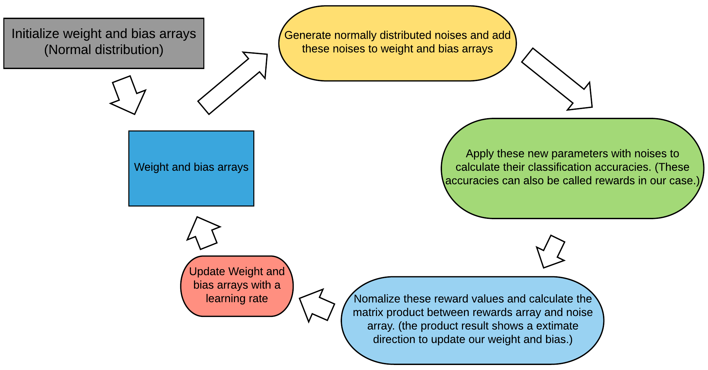
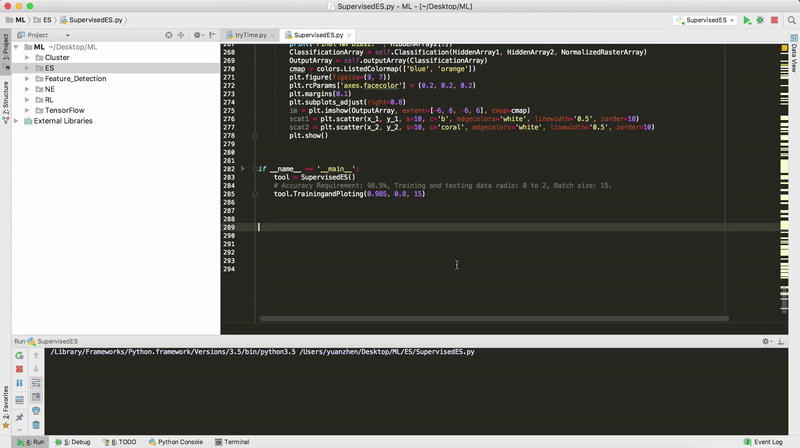
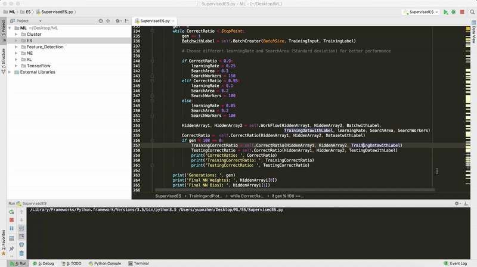

In this demo, I will classify the same Archimedean Spiral pattern based on two categories of points we inputted
in the Neural Network (NN). 7 values of each point are inputted in the NN: x, y, x^2, y^2, xy, sin(x) and sin(y).
This time, rather than use TensorFlow and Stochastic gradient descent (SGD), I build this NN with only numpy and use Evolution Strategy (ES) to train this neural network. The workflow of this demo show below:

I haven't used multiprocessing in this version, the training speed and result can already versus those in my TensorFlow
and SGD demo.

Python packages needed: 1. Numpy; 2. Matplotlib

The demo looks like this:

More details of this demo and another version with multiprocessing will be provided soon.
